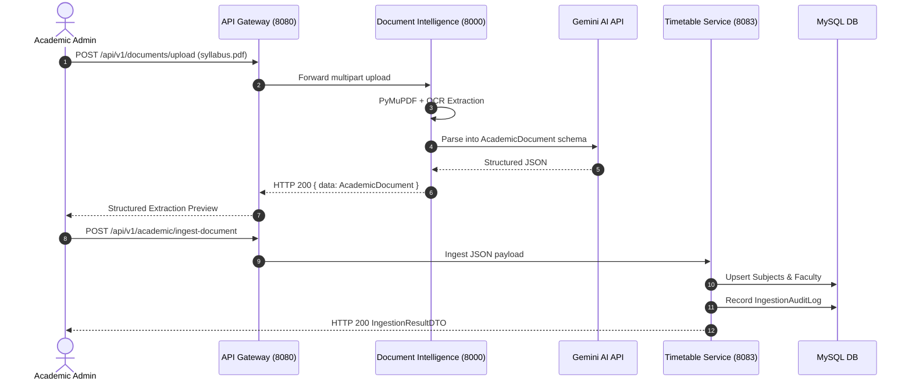

# Document Ingestion Architecture

```mermaid
sequenceDiagram
    autonumber
    actor Admin as Academic Admin
    participant Gateway as API Gateway (8080)
    participant DocIntel as Document Intelligence (8000)
    participant Gemini as Gemini AI API
    participant Timetable as Timetable Service (8083)
    participant DB as MySQL DB

    Admin->>Gateway: POST /api/v1/documents/upload (syllabus.pdf)
    Gateway->>DocIntel: Forward multipart upload
    DocIntel->>DocIntel: PyMuPDF + OCR Extraction
    DocIntel->>Gemini: Parse into AcademicDocument schema
    Gemini-->>DocIntel: Structured JSON
    DocIntel-->>Gateway: HTTP 200 { data: AcademicDocument }
    Gateway-->>Admin: Structured Extraction Preview

    Admin->>Gateway: POST /api/v1/academic/ingest-document
    Gateway->>Timetable: Ingest JSON payload
    Timetable->>DB: Upsert Subjects & Faculty
    Timetable->>DB: Record IngestionAuditLog
    Timetable-->>Admin: HTTP 200 IngestionResultDTO
```
